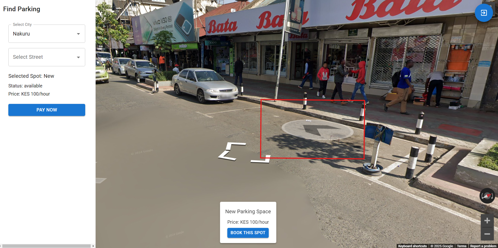

# Parking Lot Booker 🚗

A modern web application for finding and booking parking spaces in major Kenyan cities. The application provides real-time parking space availability, street view integration, and M-Pesa payment processing.



## Features ✨

- 🗺️ Interactive Google Maps integration with street view
- 🅿️ Real-time parking space availability
- 📍 Multiple cities and streets support

- 💳 M-Pesa payment integration
- ⏱️ Flexible parking duration options
- 👀 Street view booking capability
- 🎨 Modern UI with animated waves background

## Cities Covered 🏙️

- Nairobi
- Mombasa
- Kisumu
- Nakuru

## Setup Instructions 🚀

### Prerequisites

- Node.js (v14 or higher)
- npm or yarn
- Google Maps API key
- M-Pesa API credentials

### Environment Setup

1. Clone the repository:
   ```bash
   git clone https://github.com/yourusername/parking-lot-booker.git
   cd parking-lot-booker
   ```

2. Install dependencies:
   ```bash
   npm install
   ```

3. Create a `.env` file in the root directory with the following variables:
   ```env
   VITE_GOOGLE_MAPS_API_KEY=your_google_maps_api_key
   VITE_MPESA_CONSUMER_KEY=your_mpesa_consumer_key
   VITE_MPESA_CONSUMER_SECRET=your_mpesa_consumer_secret
   VITE_MPESA_BASIC_AUTH=your_mpesa_basic_auth
   ```

4. Start the development server:
   ```bash
   npm run dev
   ```

## Usage 📱

1. Select a city from the dropdown menu
2. Choose a street to view available parking spaces
3. Click on a parking space marker or use street view to find a spot
4. Select parking duration (1-24 hours)
5. Enter M-Pesa phone number and complete payment
6. Receive confirmation of your booking

## Technologies Used 🛠️

- React + TypeScript
- Vite
- Material-UI
- Google Maps API
- M-Pesa API
- Tailwind CSS

## Contributing 🤝

Contributions are welcome! Please feel free to submit a Pull Request.

## License 📄

This project is licensed under the MIT License - see the [LICENSE](LICENSE) file for details.

## Support 💬

For support, please email [your-email@example.com](mailto:your-email@example.com) or open an issue in the repository.
